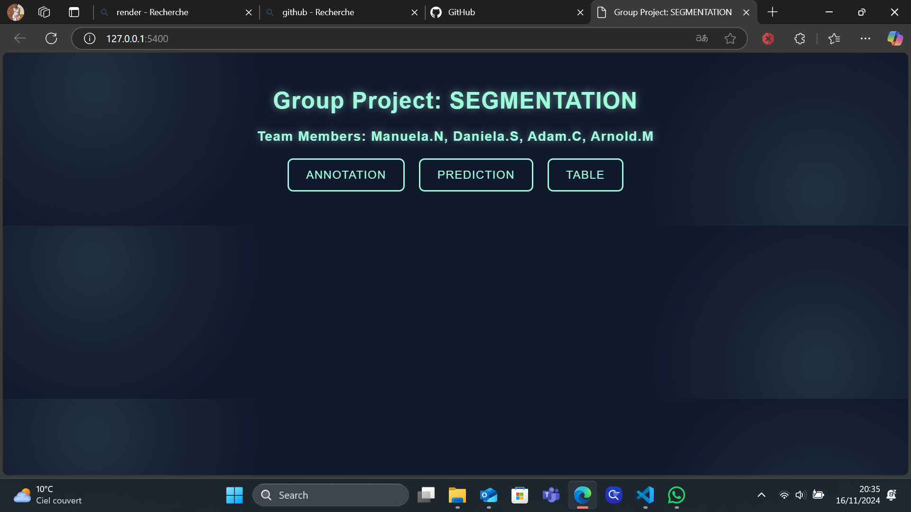

# AI Model Deployment Project: Image Segmentation Pipeline

## Overview
This project focuses on deploying deep learning models (SAM and YOLO) for image segmentation purposes. It implements a complete pipeline that enables image segmentation through a web interface. This project was developed as part of the AI Deployment course at AIvancity, under the supervision of Dr. Souhail Hanoune.

## Project Architecture
The application consists of three main components:
1. Data Labeling Interface
2. Model Training Pipeline
3. Flask Web Interface for Inference

## Features
- Interactive web interface for model interaction
- Support for both SAM and YOLO models
- Image annotation capabilities
- Segmentation prediction
- Results visualization and analysis
- Export functionality for analysis results

## Technical Stack
- **Backend**: Flask
- **Deep Learning Models**: 
  - YOLO (You Only Look Once)
  - SAM (Segment Anything Model)

## Getting Started

### Prerequisites
- Python 3.x
- Required libraries (specified in requirements.txt)
- Pretrained YOLO and SAM models
- ### PUT THE DOWNLOADED FILE (SAM) IN THE FOLDER NAMED "MODELS" WHICH IS IN THE FOLDER "APPLICATION"

### Installation
1. Clone the repository
2. Install required dependencies:
   ```bash
   pip install -r requirements.txt
   ```
3. Download the required models:
   - YOLO model from GitHub
   - SAM model from GitHub

### Usage

The application provides three main functionalities:

1. **Annotation**
   - Click the "ANNOTATION" button
   - Upload images for annotation
   - Use SAM model for interactive segmentation

2. **Prediction**
   - Click the "PREDICTION" button
   - Upload images for analysis
   - View YOLO segmentation results

3. **Results Analysis**
   - View segmentation metrics
   - Export results as CSV
   - Analyze component details

## Project Workflow

### 1. Main Interface
![Main Interface]





The main interface provides access to all major functionalities through clearly labeled buttons.

### 2. Annotation Interface
![Annotation Interface]


Users can upload and annotate images using the SAM model.

### 3. Prediction Results
![Prediction Results]


The YOLO model provides detailed segmentation with confidence scores.

### 4. Analysis Table
![Analysis Table]


Detailed metrics including:
- Image ID
- Component count
- Area measurements
- Void percentage
- Maximum void percentage

## Development Process
1. **Data Preparation**
   - Dataset labeling
   - Training data organization

2. **Model Training**
   - YOLO model training
   - Validation process
   - Performance optimization

3. **Interface Development**
   - Flask backend implementation
   - Frontend design
   - Integration testing

## Contributing
This is a school project developed under the AI Deployment course at AIvancity.

## Acknowledgments
- Dr. Souhail Hanoune - Course Instructor
- AIvancity
